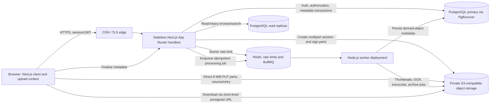

# Drive Storage Platform Architecture

## Request and Data Flow

## Components and Trust Boundaries

- The browser authenticates to stateless Next.js handlers. Handlers authorize the user and destination folder, reserve/check quota, persist multipart session state in PostgreSQL, and return short-lived presigned URLs. File bytes travel directly between browser and private object storage; application instances do not proxy file payloads.
- PostgreSQL is the source of truth for users, permissions, file metadata, quotas, and resumable upload sessions. Use a PgBouncer transaction pool in front of the primary. Route read-only browse/search queries to a separately configured read-replica client; do not send authorization or quota decisions to a lagging replica.
- Redis backs shared rate-limit counters and BullMQ. Queue workers run as a separately deployed, long-lived Node.js service, not inside serverless request handlers. Jobs are at-least-once and must be idempotent by file version/job ID.
- S3 buckets remain private. Browser access is limited to short-lived signed requests. Configure CORS to allow only deployed app origins and `PUT`, and expose `ETag` for multipart completion.

## Upload Limits and Reliability

- The current browser uses 8 MiB chunks. The API permits at most 10,000 parts (about 78.1 GiB), supports retrying failed parts, and validates that every part is present, contiguous, and sums to the declared object size before completion. The 5 GB single-PUT limit remains separate.
- Configure an S3 lifecycle rule to abort incomplete multipart uploads after one day. Configure bucket default encryption with SSE-KMS and a customer-managed key in AWS; keep KMS key policy and rotation under infrastructure control. The current Supabase-compatible endpoint may not support AWS KMS request headers.
- PostgreSQL should run multi-AZ with automated backups and PITR. Apply schema changes through reviewed migrations and test restore procedures. Connection pool limits must be sized across all app and worker replicas.
- Use a transactional outbox before treating post-upload queue delivery as guaranteed. Until then, queue enqueue failure must be observable and recoverable through reconciliation; request handlers must never run CPU-heavy transforms.

## Security and Compliance Operations

- TLS terminates at a trusted edge; enable HTTPS redirects, HSTS, and TLS 1.2+ (prefer TLS 1.3) at the load balancer/CDN. Next.js security headers include a static-compatible CSP, frame denial, MIME sniffing protection, and restricted browser permissions. The current CSP permits inline scripts for Next's statically prerendered bootstrap; migrate to CSP hashes or dynamic nonces before claiming strict CSP compliance.
- Use server-side authorization on every object and folder operation, strict Zod parsing, user-scoped Redis rate limits, private buckets, short presign expirations, and least-privilege IAM/KMS identities. The Vault encryption remains browser-side AES-GCM; do not log keys or plaintext metadata.
- SOC 2 is an operational attestation, not a code switch. Add append-only audit storage, alerting, incident response, access reviews, secrets rotation, vulnerability management, evidence retention, and tested backup/restore controls before claiming compliance.

## Deployment Configuration

- `DATABASE_URL` should point to the PgBouncer pooled endpoint; use a separate direct migration connection in deployment tooling.
- `REDIS_URL` is required in production for distributed upload rate limits and BullMQ. Production upload routes fail closed when it is absent/unavailable. Run the queue worker as a separate process using `startUploadWorker`.
- Set `CSP_EXTRA_CONNECT_SRC` to whitespace-separated, trusted HTTPS origins only when browser integrations require connections beyond the configured S3 endpoint.
- Configure `S3_REGION`, `S3_ENDPOINT` where applicable, `S3_BUCKET_NAME`, and restricted storage credentials. Set bucket policy, encryption, lifecycle, CORS, CDN origin access, and backups in infrastructure-as-code.
- The current application does not configure a read replica, transactional outbox, admin policy dashboard, or tamper-proof audit store. These remain explicit platform deployment/product work, not implied guarantees of the modules in this change.